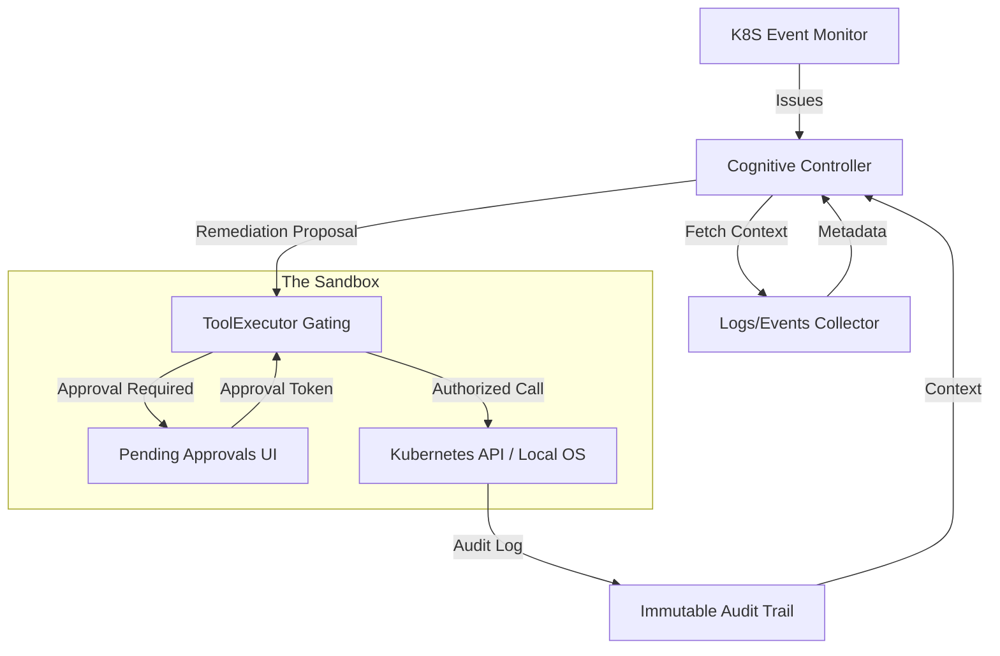

# CVA Architecture: The Cognitive SRE Loop

Catalyst Vector Alpha (CVA) is designed as a secure, agentic control loop. It follows a "Monitor -> Diagnose -> Propose -> Execute" workflow with a hard security choke point.

## System Overview

## Core Components

### 1. The Cognitive Controller (`catalyst_vector_alpha.py`)
The "Brain" of the system. It uses LLM reasoning to classify incidents and select the appropriate remediation tool. It is intentionally stateless and relies on the **Memory Store** for historical context.

### 2. Tool Registry & Profiles (`tool_registry.py` / `capabilities.py`)
Every action CVA can take is defined as a `Tool`. 
- **ToolProfile**: Defines the required capabilities (e.g., `K8S_WRITE`) and risk level (`SAFE`, `CAUTION`, `DESTRUCTIVE`).
- **Registration**: Ensures no arbitrary code can be executed; only pre-defined, validated tools are available.

### 3. ToolExecutor (The Security Choke Point)
Located in `cva_runtime/control_plane/tool_executor.py`, this is the only path to the outside world.
- It validates the agent's identity.
- It intercepts any `DESTRUCTIVE` tool calls.
- It enforces the requirement for a **Trace-bound Approval Token**.

### 4. Memory Store (`memory_store.py`)
A vector-based storage system that allows CVA to "remember" past successful remediations, helping it avoid repetitive failures and improving proposal quality over time.

## Security Design Principles
- **Zero-Shell Policy**: No raw shell execution. All system calls use list-style subprocesses.
- **Trace Accountability**: Every action is linked to a unique `trace_id` for end-to-end auditing.
- **Least Privilege**: Agents are assigned specific roles (Observer, Worker, Security) that restrict their tool access.
